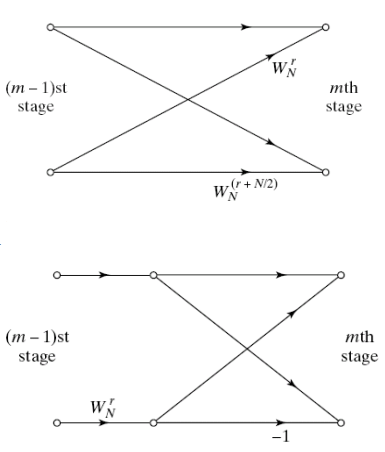

# Fast Fourier Transfer
---
---
---

## Computational Complexity of DFT
- N-point DFT의 경우, N번 DFT를 수행하야한다.
- point 수가 많을수록 점점 계산 복잡도가 늘어남.(Multiple Complexity ∝ N^2 )
- 그렇다고 point 수를 줄이기엔 resolution이 낮아진다.(Resolution ∝ N)
- 따라서 이런 문제를 해결하기 위해, FFT를 만들어낸 거라 보면 됨.
  - point 수가 많을수록 FFT의 효율은 높아진다.
  - 연산량을 줄이면 발생하는 장점과 단점에 대해 생각해보자.
    - 계산량을 줄여 얻는 가장 큰 이득 두가지: 소비 전력 감소 & 사용하는 메모리 감소

## Decimation-in-Time Algorithm
- decimation-in-Time: freq domain은 모두 사용하고, 이를 기반으로 time demain의 일부를 삭제한다.
- decimation-in-Frequency: time domain은 모두 사용하고, 이를 기반으로  freq domain의 일부를 삭제한다.

- N-point DFT를 N/2-point DFT 두개의 합으로 나타낼 수 있다.
- 덧셈은 곱셈에 비해 간단하게 나타낼 수 있음. 복잡도 계산시, N-point DFT는 N^2, N/2-point DFT는 (N/2)^2 * 2 이므로 총 복잡도는 절반이 줄어든 꼴이 된다.
- 동일한 알고리즘을 적용해, 하나의 식을 2-point DFT 여러개의 합으로 나타낼 수 있다.
  - 이떄 2-point DFT는 뺼셈을 통해 구현 가능하다. -> 곱셈이 필요 없으니 매우 빠르게 수행 가능.
```c
// first
for(int n = 0; n < N-1; n++)
    dft_result += x[n] * W(N, n*k);

// second
for(int n = 1; n < N-1; n+=2)
    even[k] += x[n] * W(N, n*k);
for(int n = 0; n < N-1; n+=2)
    odd[k] += x[n] * W(N, n*k);

// third
for(int n = 0; n < N/2-1; n++)
    even[k] += x[2*n + 1] * W(N, 2*n * k) * W(N, k);
    // W(N, (2*n + 1) * k) = W(N, 2*n * k) * W(N, k)
for(int n = 0; n < N/2-1; n++)
    odd[k] += x[2*n] * W(N, 2*n * k);

X[k] = mode ? dft_result : even[k] + odd[k];
```

### Graph


- 현재 그림은 8-point DFT를 나눈 것이다.
- 흰색 동그라미(두 선이 만나는 지점): 덧셈
- edge에 있는 상수(W): 곱셈
- 파란색 선은 stage를 의미하며, 각 스테이지마다 곱셈이 행해지는 횟수는 비슷하다.(총 곱셈 량: N * log(N))
- 첫번째 스테이지는 2-point DFT를 의미하며, 2번쨰는 2-point DFT를 통해 4-point DFT를 만드는 과정을, 3번째는 4-point DFT를 통해 8-point DFT를 만드는 과정을 의미한다.



- 이런 모듈 하나를 나비를 닮았다고 해서 butterfly module이라고 말한다.
- 일반적인 butterfly module 하나에 곱셈이 두번 적용된다 -> 이걸 곱셈 한번으로 줄인게 아래의 모듈
- 먼저 상수를 곱해주고, 나중에 부호를 뒤집어 곱셈을 줄인다.
```text
W(N, r) = pow(e, -j*2*pi*r/N) 
W(N, r + N/2) = pow(e, -j*2*pi*(r + N/2)/N)
              = pow(e, -j*2*pi*r/N) * pow(e, -j*2*pi*(N/2)/N)
              = W(N, r) + pow(e, -j)

이때, 오일러 공식에 따라 다음 공식이 성립한다.
pow(e, -j) = cos(-pi) + j*sin(-pi)
           = -1
따라서, W(N, r + N/2) = - W(N, r)
```

### Indexing
- 인덱싱이 귀찮다 -> 그래프를 보면 0, 4, 2, 6 ... 순서대로 인덱싱 한 것을 볼 수 있다.
- input을 설정해주던가, 아니면 output을 설정해주던가 해야됨
  - input index을 0~7까지 순서대로 set할 경우 -> output index = 0,4,2,6,1,5,3,7
  - input index를 0,4,2,6,1,5,3,7로 set 할 경우 -> output index = 0,1,2,3,4,5,6,7
  - 이진수로 바꿔서 생각해보자
    ```text
    input              output              input                  output
    000(0) <-------->  000(0)              000(0) <-------------> 000(0)
    001(1) <-------->  100(4)              100(4) <-------------> 001(1)
    010(2) <-------->  010(2)              010(2) <-------------> 010(2)
    011(3) <-------->  110(6)              110(6) <-------------> 011(3)
    100(4) <-------->  001(1)              001(1) <-------------> 100(4)
    101(5) <-------->  101(5)              101(5) <-------------> 101(5)
    110(6) <-------->  011(3)              011(3) <-------------> 110(6)
    111(7) <-------->  111(7)              111(7) <-------------> 111(7)
    ```

## Conclusion
- DFT Equation
    ```c
    for(int n = 0; n < N-1; n++)
        X[k] += x[n]*W(N, n*k);
        // W(N, n*k) = pow(e, -j*2*pi*n*k/N)
    ```

- Split DFT Equation to add of two equations
    ```c
    // front and tail
    for(int n = 0; n < N/2-1; n++)
        front[k] += x[n]*W(N, n*k);
    for(int n = N/2; n < N-1; n++)
        tail[k] += x[n]*W(N, n*k);
    
    // even and odd
    for(int n = 1; n < N/2-1; n+=2)
        even[k] += x[2*n+1]*W(N, 2*n*k)*W(N, k);
    for(int n = 0; n < N/2-1; n+=2)
        odd[k] += x[2*n]*W(N, 2*n*k);
    
    X[k] = mode ? front[k] + tail[k] : even[k] + odd[k];
    ```
- Replace k to 2*r
    ```c
    // revisit front and tail
    for(int n = 0; n < N/2-1; n++)
        front[2*r] += x[n]*W(N, 2*n*r);
    for(int n = 0; n < N/2-1; n++)
        tail[2*r] += x[n + N/2]*W(N, 2*(n + N/2)*r);
        // 범위를 앞으로 당기는 대신 변수에 N/2를 더해준다.

    // is equal as
    for(int n = 0; n < N/2-1; n++)
        X[2*r] += x[n]*W(N, 2*n*r) + x[n + N/2]*W(N, 2*n*r) * W(N, N*r);
        // W(N, N*r) = pow(e, -j*2*pi*r) = cos(2*pi*r) - j*sin(2*pi*r)
        // 이때, r은 정수이므로 cos(2*pi*r) = 1, sin(2*pi*r) = 0

    // is equal as
    for(int n = 0; n < N/2-1; n++)
        X[2*r] += (x[n] + x[n + N/2])*W(N/2, n*r);
        // W(N/2, r*N/2) = 1
    ```
- Replace k to 2*r+1
    ```C
    // revisit front and tail
    for(int n = 0; n < N/2-1; n++)
        front[2*r + 1] += x[n]*W(N, n*(2*r + 1));
    for(int n = 0; n < N/2-1; n++)
        tail[2*r + 1] += x[n + N/2]*W(N, (n + N/2)*(2*r + 1));

    // is equal as
    for(int n = 0; n < N/2-1; n++)
        X[2*r + 1] += x[n]*W(N, n*(2*r + 1)) + x[n + N/2]*W(N, n*(2*r + 1))*W(N, (2*r + 1) * N/2);
        // W(N, (2*r + 1) * N/2) = pow(e, -j*pi*(2*r + 1)) = pow(e, -j*2*pi*r) * pow(e, -j*pi)
        // pow(e, -j*2*pi*r) = cos(2*pi*r) + j*sin(2*pi*r) = 1
        // pow(e, -j*pi) = cos(pi*r) + j*sin(pi*r) = -1
        // W(N, (2*r + 1) * N/2) = -1
    
    // is equal as
    for(int n = 0; n < N/2-1; n++)
        X[2*r + 1] += (x[n] - x[n - N/2])*W(N/2, n*(2*r + 1));
        // W(N, n*(2*r + 1)) = W(N/2, n*r) * W(N, n) = W(N/2, n*r) * W(N/2, n/2)
        // W(N, n) = pow(e, -j*2*pi*n/N) = pow(e, -j*8*pi* (2*n)/(N/2))
        //         = cos(2*pi*n/N) + 
    ```