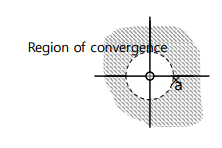

# 9. Z transform
---
---
---
## Z Transform
- 실 수열 혹은 복소 수열로 나타나는 시간 영역의 신호를 주파수 영역의 표현으로 변환하는 방법 
- 일반적인 라플라스 변환과 달리, 이산 신호 영역에서의 변화임.

## Equation
- Laplace Transform
    $F(s) = \int ^{\infin}_{0}f(t)e^{-st}dt$
     
- The one-sided z-transform
    $X(z) = \Sigma_{n = 0}^{\infin}x(n)z^{-n}$
     
- The two-sided z-transform
    $X(z) = \Sigma_{n = -\infin}^{\infin}x(n)z^{-n}$

## Z 
- 일반적으로 복소수를 의미한다.
- 즉, 어떤 복소수도 될 수 있다는 의미이기도 함.
    $z= Ae^{j\phi} = A(cos\phi + jsin \phi)$

## Relationship btw Z transfrom and FT
- Z 변환을 통해 푸리에 변환을 유도할 수 있음
    $X(z) = \Sigma_{n = -\infin}^{\infin}x(n)z^{-n}$
    $z= Ae^{j\phi} = A(cos\phi + jsin \phi)$
    $X(re^{j\phi}) = \Sigma_{n = -\infin}^{\infin} x(n) (re^{j \phi})^{-n}$
    $X(re^{j\phi}) = \Sigma_{n = -\infin}^{\infin} x(n) r^{-n}e^{-j \phi n}, if\space r = 1,$
    $X(re^{j\phi}) = \Sigma_{n = -\infin}^{\infin} x(n)e^{-j \phi n} = {\mathcal F}\left\{x(n)\right\}$
    - 즉, 복소수 z가 양자화되지 않은 상태라면 이는 푸리에 변환과 같은 의미가 된다.
    - 이에 대해, z는 복소수가 A(혹은 n)에 대해 등비 수열의 형태로 양자화된 상태라고 간주하면 된다.

### Example 1
$x(n) = a^n u(n)$ 
- z transform: $X(z) = \Sigma {a^n}u(n)z^{-n} = \Sigma u(n)(az^{-1})^{n}$
- 이는 등비가 $\frac {a}{z}$인 등비수열의 합이므로 다음과 같이 세 가지 경우로 나타낼 수 있다.
  1. 등비 $\frac {a}{z}$가 $|a| < |z|$일 경우 
  $X(n) = ({a^0}u(0)z^{-0})\frac {1 - (\frac{a}{z})^n}{1 - \frac{a}{z}} = \frac {z}{z - a}$
   
     - 해당 급수는 등비의 절댓값이 1보다 작으므로 수렴한다.
  2. 등비 $\frac {a}{z}$가 $|a| >= |z|$일 경우
     - 해당 급수는 등비의 절댓값이 1보다 크므로 발산한다.
  3. $z = 0$일 경우 -> 극한을 통해 구한다.
    - 좌극한: $lim_{z = 0-} \frac {z}{z - a} = \frac{0}{a} = 0$
    - 우극한: $lim_{z = 0+} \frac {z}{z - a} = -\frac{0}{a} = 0$
    - 극한이 서로 같으므로 $z = 0$일때, $X(n) = 0$

- 위의 근을 조합하면 다음과 같은 그래프를 얻을 수 있다.
    
    - $z = 0$일때, 극한에 의해 $X(z) = 0$
    - $|z| >= |a|$일때 발산하므로 근을 갖지 않는다
    - $z$가 $a$에 가까워지는 경우를 상정해보자.
        - 좌극한: $lim_{z = a+} \frac{z}{z-a} = \infin$
        - 우극한: $lim_{z = a-} \frac{z}{z-a} = - \infin$
        - 이와 같이 식이 $\infin$ 혹은 $-\infin$이 되는 지점을 pole이라고 한다. 즉, 해당 시스템은 $z = a$일때 pole을 갖는다.

    - $|z| < |a|$일때, 수렴하므로 근을 갖는다.

### Example 2
$y = x[n - 1]$
- z 변환을 취한다
    $Y(z) = \Sigma y[n](az^{-1})^n = \Sigma x[n - 1]Z^{-n} = \Sigma x[n']Z^{-(n' + 1)} = Z^{-1} \Sigma x[n']Z^{-n'}$
     
  - $\Sigma x[n']Z^{-n'} = X(Z)$
 

- $X(Z)$를 대입
    $Y(Z) = Z^{-1}X(Z)$
    $ZT\left\{x[n - 1]\right\} = Z^{-1}X(Z)$
- 결론: $ZT\left\{x[n - m]\right\} = Z^{-m}X(Z)$

### Example 3
$y[n] = 6x[n] - 5x[n - 1]+ x[n - 2]$
- z 변환을 취한다.
    $Y(Z) = 6X(Z) - 5Z^{-1}X(Z) + Z^{-2}X(Z)$
    $X(Z) = \frac{Y(Z)}{6 - 5Z^{-1} + Z^{-2}}$
     
    $y[n] = x[n] *h[t], Y(Z) = X(Z)H(Z)$
    $H(Z) = \frac {Y(Z)}{X(Z)} =  6 - 5Z^{-1} + Z^{-2} = 6 \frac{(z - \frac{1}{3})(z - \frac{1}{2})}{z^2}$
    

## Property
1. Linearity - 선형성
   $\mathcal Z \left\{ax[n] + by[n]\right\} = aX(z) + bY(z)$
2. Shift Sequence
   $\mathcal Z \left\{x[n + n_0]\right\} = z^{n_0} X(z)$
3. Multiplication
   $\mathcal Z \left\{a^nx[n]\right\} = X(a^{-1}z)$
4. Convolution
   $w[n] = \Sigma x(k)y(n - k)$
   $\mathcal Z \left\{w[n]\right\} = \Sigma [\Sigma x(k)y(n - k)] z^{-n} = \Sigma x(k) \Sigma y(n - k)z^{-n}$
   - let $m = n - k$
   $w(z) = \Sigma{x(k)[\Sigma y(m)z^{-m}}]z^{-k} = X(z)Y(z)$
   