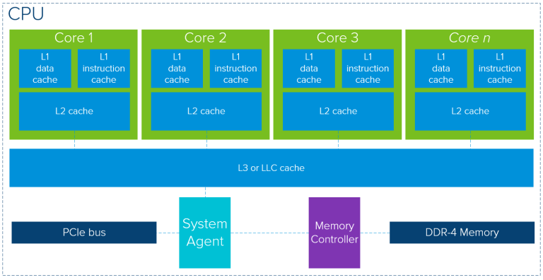
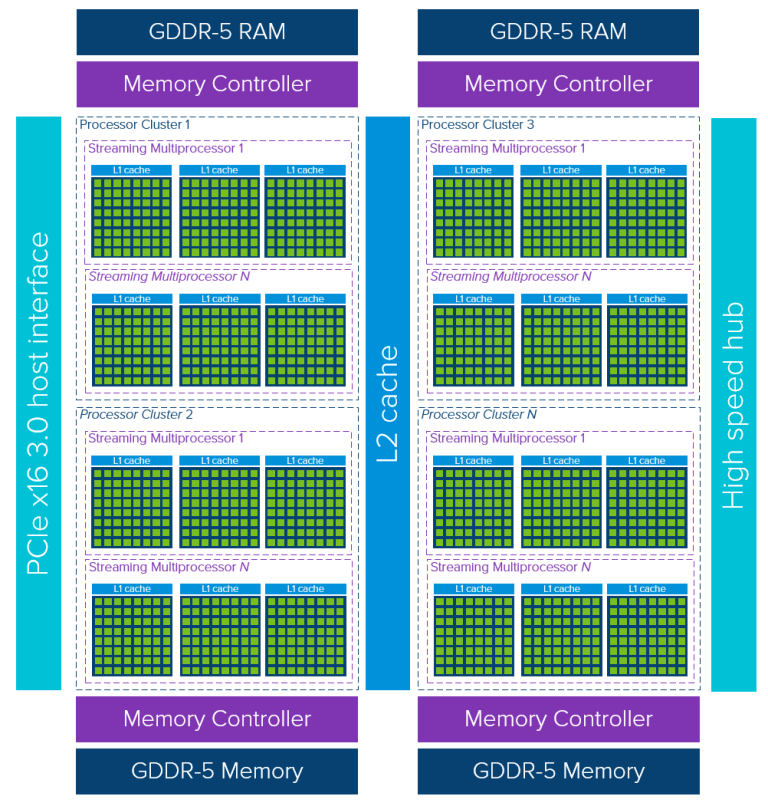
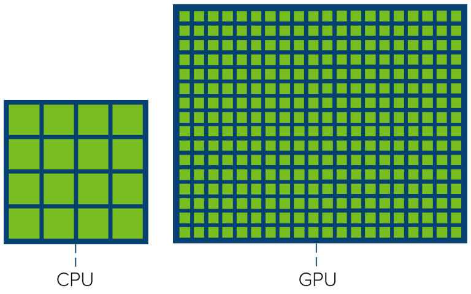

# 1. GPGPU
- 작성자: 201711237 유재덕(yjd_1998@naver.com)
- 작성일: 2019.09.02

---
---
---
## CPU와 GPU

### CPU
- 분기점이 있는 데이터를 처리하는데 최적화되어있음 -> 하버드 아키텍처, 슈퍼 파이프라인 구조
- 연쇄 작용을 고려한 구조 설계 -> 중간에 작업을 전환한다는 것을 고려함
- 단, 처리 속도의 한계가 존재한다 -> 빅 데이터를 처리하는데 한계가 존재한다
- 컴퓨터 구조에 배운 그 구조 그대로라 생각하면 된다.

### GPU
- 이미지에 필터를 입히는 작업 등 동일한 데이터를 비슷한 방식으로 처리하는데 최적화되어있음 -> 빅 데이터를 처리하는데 용이하다.
- 중간에 작업을 전환한다는 개념을 거의 적용하지 않는다 -> 사용자가 최적화해주어야함.
- 한번에 많은 데이터를 가져와  연산하기 때문에 분기점이 나뉠때 쓸데 없는 연산을 진행할 확률이 존재한다.

### Core Comparison

- 연쇄적인 명령들을 주로 처리하는 CPU에 비해, 유사한 데이터를 한번에 처리하는 GPU는 사용 가능한 코어 수가 훨씬 많다. 즉, 한번에 처리할 수 있는 데이터가 훨씬 많다고 생각하면 됨.

### Similarities
- 캐시 메모리와 메모리 컨트롤러, 글로벌 메모리를 사용함
- 
### Differences
#### Architecture
  - CPU
    1. 각 코어마다 일부 캐시 메모리(layer-1 cache, layer-2 cache)가 서로 분리되어있음
    2. 캐시 미스가 발생할 확률을 최대한 줄이려는 모델

  - GPU
    1. Thread -> Streaming MultiProcessor(SM) -> Processor Cluster(PC) -> GPU
    2. 각각 SM은 layer-1 instruction cache를 할당받는다 -> 하나의 SM은 할당된 layer-1 cache와 공용하는 layer-2 cache를 사용. 두 곳 모두에 정보가 없다면 글로벌 메모리에서 데이터를 가져온다.
    3. 데이터를 가져오는데 요구되는 시간의 가치를 낮게 잡는다. -> 늦게 가져와도 계속 연산을 진행하고 있을 가능성이 크기 때문
## GPGPU
- CPU와 GPU의 역할을 적절히 분배해 많은 양의 데이터를 더 빠른 시간 내로 처리할 수 있도록 해주는 방식 -> 빅데이터를 사용하는 경우, 최소 두배에서 몇천배까지 더 빠른 구조를 만들 수 있다.
  - 일반적으로 메인 쓰레드는 CPU 내에 존재하며, CPU는 특정 명령어가 실행될때마다 데이터를 GPU에 복사하고 GPU를 통해 연산 실행 후 연산된 데이터를 가져오는 방식을 취한다.

- Machine Learning (ML), Deep Learning (DL), and Artificial Intelligence (AI)등 많은 데이터를 처리하는 분야에 필수적으로 사용되는 기법이며, CPU가 처리하기 힘든 양의 데이터를 GPU로 전송해 처리한 후 결과만 가져온다.

- 해당 자료는 GPGPU를 학습하며 작성된 내용임.

## Using GPU in Desktop
- VMware vSphere ESXi에서 데스크톱 및 노트북에서 GPU를 사용할 수 있도록 지원해준다.
- 아래의 자료들을 참고할 것.
  1. [Using GPUs with Virtual Machines on vSphere – Part 1: Overview](https://blogs.vmware.com/apps/2018/07/using-gpus-with-virtual-machines-on-vsphere-part-1-overview.html)
  2. [Using GPUs with Virtual Machines on vSphere – Part 2: VMDirectPath I/O](https://blogs.vmware.com/apps/2018/09/using-gpus-with-virtual-machines-on-vsphere-part-2-vmdirectpath-i-o.html)
  3. [Using GPUs with Virtual Machines on vSphere – Part 3: Installing the NVIDIA GRID Technology](https://blogs.vmware.com/apps/2018/09/using-gpus-with-virtual-machines-on-vsphere-part-3-installing-the-nvidia-grid-technology.html)
  4. [Using GPUs with Virtual Machines on vSphere – Part 4: Working with BitFusion FlexDirect](https://blogs.vmware.com/apps/2018/10/using-gpus-with-virtual-machines-on-vsphere-part-4-working-with-bitfusion-flexdirect.html)