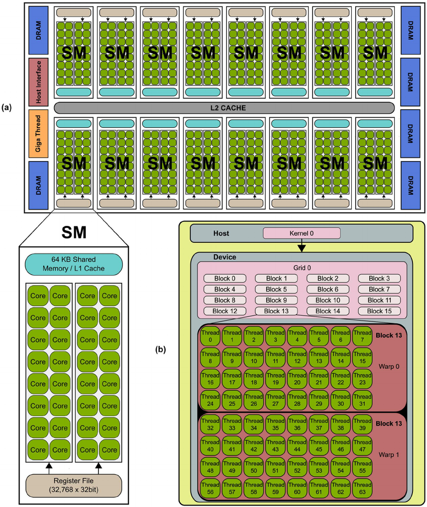

# 1. Graphic Card Architecture
- 작성자: 201711237 유재덕(yjd_1998@naver.com)
- 작성일: 2019.09.02
---
---
---
## Graphic Card Architecture

- Jetson Nano 보드를 사용하므로 NVIDIA 아키텍처를 기본으로 한다.
- Hardware: Core -> Streaming Multiprocessor -> Device
  - Core(= Scalar Processor): 실질적으로 연산을 진행하는 소자들
  - Streaming Multiprocessor: N개의 코어를 묶어 하나의 SM로 명명.
    - 각각의 SM은 하나의 layer-1 cache를 할당받으며, layer-2 cache와 글로벌 메모리는 모든 SM이 공유한다.
  - Device: N개의 PC를 묶어 하나의 GPU로 명명.

- Software: Thread -> Warp -> Block -> Grid
  - Thread: 하나의 코어에서 한 클럭에 수행해야하는 연산들
  - Warp: 일반적으로 32개의 코어에서 일어나는 연산을 하나의 Warp이라고 한다. -> 안 쓰이는 경우가 다수 있음
  - Block: N개의 쓰레드를 하나의 블록이라 명명 -> N은 경우에 따라 달라짐
  - Grid: M개의 블록을 하나의 그리드라 명명 -> N은 경우에 따라 달라짐

## HW/SW Mapping
- 일반적으로 하나의 코어에는 4개의 쓰레드가 기준시간동안 파이프라인 구조로 수행된다.(기준시간 = 4 clock)
- Warp의 기준은 32 쓰레드, 혹은 하나의 SM에서 수행되는 쓰레드의 개수로 본다.
- Grid와 Block은 가상의 공간에 매핑된 위치라 보면 됨.
- Grid와 Block의 기준(N, M)은 코딩할 때 주어진다.(ex. printHelloGpu<<<**1,1**>>>)
  - N, M은 실수 및 dim 변수를 가질 수 있다. 이후 배울 예정.